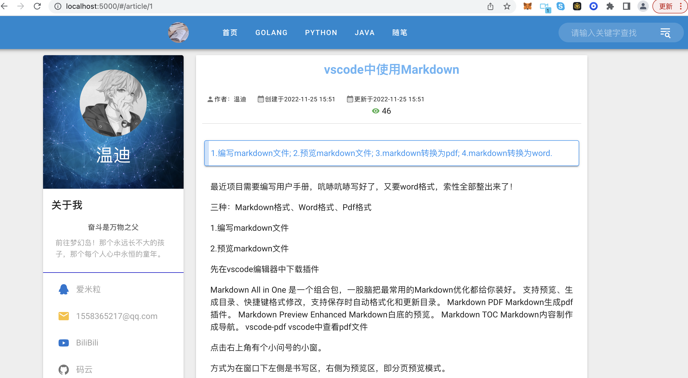
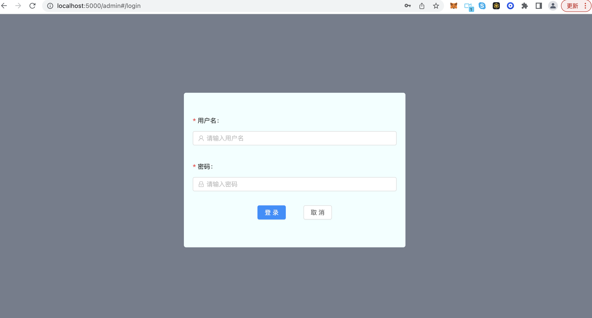
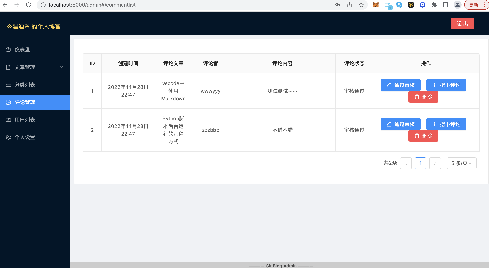
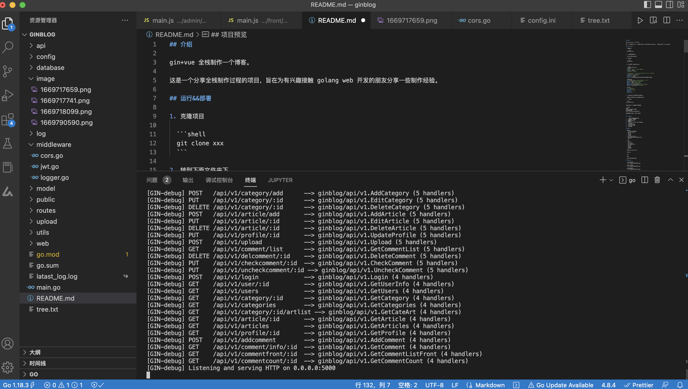

## 介绍

基于 go 的个人博客系统。

gin+vue 全栈制作一个博客。

## 运行&&部署

1. 克隆项目

	```shell
	git clone https://github.com/wendy0626-cli/ginblog.git
	```
	
2. 转到下面文件夹下

	cd yourPath/ginblog

3. 安装依赖

  ```shell
  go mod tidy
  ```

4. 初始化项目配置config.ini

  ```ini
  ./config/config.ini
  [server]
  # debug 开发模式，release 生产模式
  AppMode = debug
  # AppMode = release

  # HttpAddress开发模式localhost，服务器0.0.0.0 注意踩坑
  # HttpAddress = localhost
  HttpAddress = 0.0.0.0
  HttpPort = :5000
  JwtKey = 4ti7ng2y0usedht79wseh1ts5eyt7yghb6srf2dhg

  [database]
  Db = mysql #数据库类型，不能变更为其他形式
  DbHost = 127.0.0.1 # 数据库地址
  DbPort = 3306 # 数据库端口
  DbUser = root # 数据库用户名
  DbPassWord = Admin1234！ # 数据库用户密码
  DbName = blog_vue_gin # 数据库名

  [qiniu]
  # 七牛储存信息
  AccessKey = # AK
  SecretKey = # SK
  Bucket = 
  QiniuSever =
  ```

5. 在database中将sql文件导入数据库

  推荐navicat或者其他sql管理工具导入

6. 启动项目

```shell
 go run main.go
```

此时，项目启动，你可以访问页面

```shell
首页
http://localhost:5000
后台管理页面
http://localhost:5000/admin

默认管理员:admin  密码:123456
```

## 实现功能

1.  简单的用户管理权限设置
2.  用户密码加密存储
3.  文章分类自定义
4.  列表分页
5.  图片上传七牛云（开源中已剔除）
6.  JWT 认证
7.  自定义日志功能
8.  跨域 cors 设置
9.  阅读量统计

## 技术栈

- golang
  - Gin web framework
  - gorm(v1 && v2)
  - jwt-go
  - scrypt
  - logrus
  - gin-contrib/cors
  - go-playground/validator/v10
  - go-ini
  
- 前端
  - vue
  - vue cli
  - vue router
  - ant design vue
  - vuetify
  - axios
  - tinymce
  - moment
  
- MySQL version:8.0.21

- flutter

  dio

  getx

  接口测试工具postman

## 项目预览

- 前端展示页面
  

- 后台登录页面
  

- 后台管理页面
  

- 项目目录
  

## vue前端基础

1.先执行npm run build，生成dist目录后移动到static目录下。

2.修改静态资源托管路径，前端项目下直接打包，不用再移动到static目录下，更加方便。

